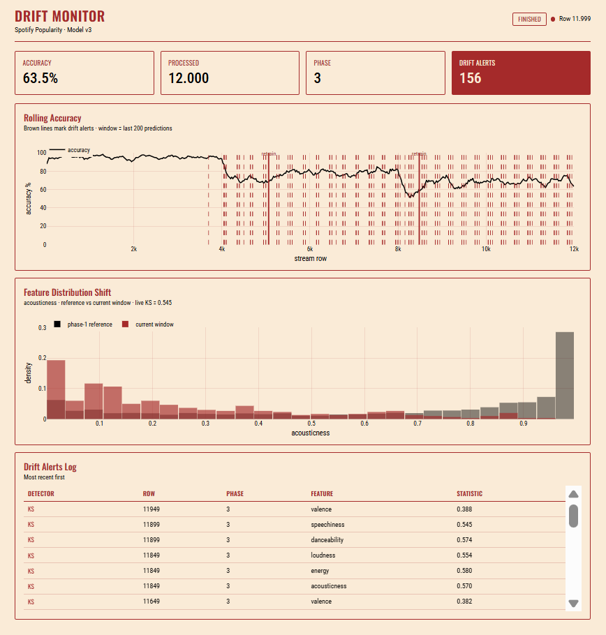

# Spotify Popularity Pipeline with Genre Drift Detection

A real-time machine-learning system that streams Spotify track features through
Apache Kafka, predicts track popularity on each message, **detects when the model
starts to fail**, and **automatically retrains and hot-reloads a new model** —
all running locally with a single `docker compose up`.

The ML component is deliberately simple (a popularity classifier); the value is
in the **systems and MLOps**: streaming ingest, decoupled microservices, two
complementary drift detectors, a live dashboard, and a closed retraining loop.

---

## What it demonstrates

The stream is engineered to drift through three musical regimes so the system has
something real to detect and recover from:

| Phase | Genres | Character |
|-------|--------|-----------|
| 1 | acoustic, classical, folk, piano | calm, acoustic — **model trained here** |
| 2 | edm, techno, house, trance | high-energy electronic |
| 3 | hip-hop, r-n-b, reggaeton, dancehall | vocal, rhythmic |

A model trained only on Phase 1 predicts well at first, then degrades as the
stream shifts into unfamiliar genres. The system catches this and self-heals.

**Result (single run):** accuracy holds ~95% through Phase 1, drops at each genre
boundary, and recovers after each automatic retrain:

- Phase 2: dropped to ~68% → retrained → recovered to ~78–80%
- Phase 3: dropped to ~52% → retrained → recovered to ~72–75%

Recovery is strong but bounded — popularity is intrinsically hard to predict from
audio features alone, so a retrained model adapts to the new genre without
reaching Phase 1's peak. This is realistic continuous-training behaviour, not a
demo that overfits.



---

## Architecture

Eight containerised services communicating only through Kafka topics (no direct
calls — fully decoupled):

```
producer ─► raw-tracks ─► inference ─► predictions ─► drift monitor ─► drift-alerts
                              │                                              │
                              ▼                                              ▼
                        models/ (versioned)  ◄──── retrainer ◄──────────────┘
                              │                       ▲
                              │ hot-reload            │ reads buffer
                              ▼                        │
                        (inference swaps to new model) │
                                                       │
   dashboard ◄── predictions + drift-alerts ───────────
   mlflow    ◄── training runs (metrics per model version)
```

| Service | Role |
|---------|------|
| `kafka` | KRaft-mode broker (no Zookeeper); message backbone |
| `kafka-ui` | Topic/message inspection at `localhost:8080` |
| `producer` | Streams the genre-ordered CSV into `raw-tracks` |
| `consumer` | Inference (predicts, writes buffer, hot-reloads) **+** drift monitor (KS + ADWIN), as threads |
| `retrainer` | Hears concept-drift alerts, retrains on recent data, publishes a new model version |
| `dashboard` | Live monitoring UI at `localhost:5000` |
| `mlflow` | Experiment tracking + UI at `localhost:5001` |

---

## Drift detection — two complementary detectors

- **KS test (data drift):** per-feature Kolmogorov–Smirnov test comparing a
  sliding window of recent values against the Phase-1 reference distribution.
  Needs no labels; fires the moment inputs shift. Caught the acoustic→electronic
  shift with KS ≈ 0.68 on `acousticness`.
- **ADWIN (concept drift):** watches the model's error stream and fires when the
  error *rate* rises — i.e. the model is actually failing. Needs labels.

The two can disagree, and that disagreement is informative: in Phase 3 the KS
test flagged a clear input shift while ADWIN stayed quiet, because the retrained
model coped — so no further retrain was triggered. Detecting "the inputs changed"
is different from "the model is failing," and the system distinguishes them.

---

## Automated retraining (closed loop)

1. Inference appends every labelled track to a rolling buffer (`data/buffer/`).
2. The retrainer listens for **ADWIN** concept-drift alerts.
3. On an alert it waits for the buffer to accumulate fresh post-drift data, then
   trains a new model on **data after the drift point** (pure new-genre data, no
   old-genre contamination).
4. The new model is published as a versioned bundle; the running inference service
   detects the new version and **hot-reloads it without restarting**.
5. A cooldown prevents repeated retraining during one drift episode.

Triggering on ADWIN (real degradation) rather than KS (mere input change) ties
the expensive retrain to genuine performance loss.

---

## Quick start

```bash
# 0. Activate the virtual environment (first time: create it and install deps)
python -m venv .venv          # first time only
source .venv/bin/activate     # Windows: .venv\Scripts\activate
pip install -r requirements.txt   # first time only

# 1. Generate the genre-ordered dataset (auto-downloads the source CSV)
python data/genre_ordering.py

# 2. Train the baseline model (Phase-1 only)
python retrainer/train_model.py

# 3. Launch everything
docker compose up --build
```

Or simply run **`bash reset.sh`**, which does a full clean run (activate venv →
wipe → start MLflow → train baseline → bring up the stack) in one command.

Then open:

- **Dashboard** — http://localhost:5000 (live accuracy, drift, distribution shift, alerts log)
- **MLflow** — http://localhost:5001 (metrics per model version)
- **Kafka UI** — http://localhost:8080 (topics and messages)

---

## Configuration

Key knobs in `.env` (all have safe defaults):

| Variable | Meaning |
|----------|---------|
| `PRODUCER_DELAY_SECONDS` | Pace of the stream (lower = faster) |
| `PRODUCER_LOOP_FOREVER` | Loop the stream or run once |
| `DRIFT_WINDOW_SIZE` | KS sliding-window size |
| `DRIFT_KS_PVALUE` | KS significance threshold |
| `RETRAIN_DELAY_ROWS` | Rows of post-drift data to gather before retraining |
| `RETRAIN_COOLDOWN_ROWS` | Min gap between retrains |
| `BUFFER_MAX_ROWS` | Rolling buffer size for retraining data |

---

## Tech stack

Apache Kafka (KRaft) · confluent-kafka · scikit-learn · imbalanced-learn (SMOTE)
· river (ADWIN) · scipy (KS) · Flask + Plotly (dashboard) · MLflow · Docker
Compose.

---

## Project structure

```
├── data/              genre_ordering.py, download_dataset.py, buffer/
├── shared/            schemas.py (message contracts), model_registry.py (versioning)
├── producer/          producer.py + Dockerfile
├── consumer/          consumer_inference.py, consumer_drift.py, main.py + Dockerfile
├── retrainer/         retrainer.py, train_model.py + Dockerfile
├── dashboard/         backend.py, static/index.html + Dockerfile
├── models/            versioned model bundles + current.txt pointer
├── docker-compose.yml
└── .env
```

---

## Notes & honest limitations

- Popularity prediction from audio features has a real ceiling (baseline F1 ≈ 0.31);
  the project's focus is the drift-detect-retrain loop, not a state-of-the-art
  classifier.
- The KS test produces occasional false positives at p < 0.05 across many
  features — expected from multiple testing; a stricter threshold or a
  multiple-comparison correction would reduce them.
- "Recent-buffer-only" retraining adapts fully to new genres but does not retain
  old ones (a deliberate trade-off; a mixed buffer would avoid this).
- Single-broker Kafka and SQLite-backed MLflow are local-demo choices, not
  production HA configurations.
